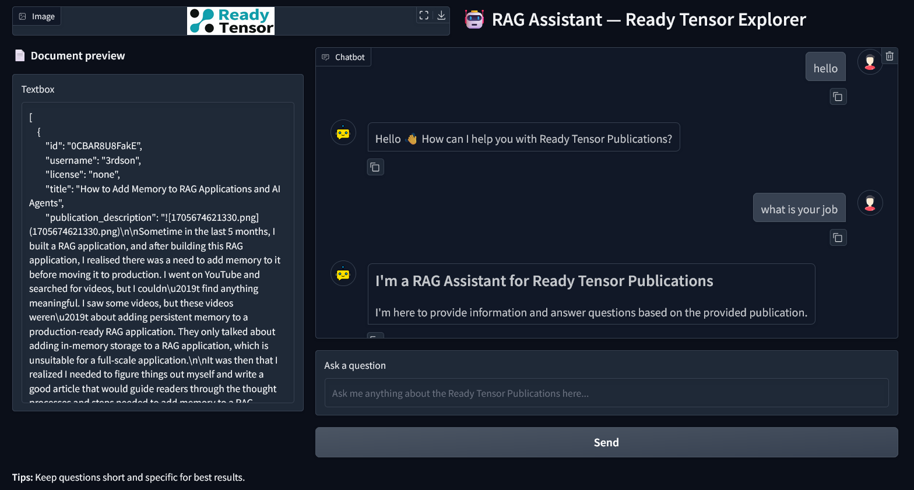

## Ready-Tensor-Publication-Explorer — RAG Chatbot 📘🤖

---
### 📝 Project Summary


This project is a Retrieval-Augmented Generation (RAG) assistant designed to answer questions based on a specific publication. It uses embeddings, vector search, and a large language model (LLM) to provide precise, publication-grounded responses.

---
### 🔎 Project Overview


The RAG assistant processes the publication into document chunks, stores them in a vector database, and uses similarity search to retrieve the most relevant sections when a user asks a question. These chunks are then passed to the LLM, which generates context-aware answers.

* Ensures responses are accurate and grounded in the provided publication.
* Refuses to hallucinate or provide out-of-scope information.
* Runs locally via Python and command-line interface (CLI).
* Supports future extension to a web interface.

---
### 📖 Project Description

This project implements a Retrieval-Augmented Generation (RAG) pipeline tailored for answering questions from a specific publication. Unlike general-purpose chatbots, this assistant is restricted to the knowledge contained within the provided document, ensuring precise and trustworthy responses.

Key aspects of the system include:

* **Document Ingestion**: Splits the publication into manageable text chunks and stores them in a vector database.
* **Vector Search**: Uses similarity-based retrieval to find the most relevant document sections for each query.
* **LLM Integration**: Leverages a large language model to generate coherent answers grounded in the retrieved content.
* **Guardrails**: Prevents hallucination, out-of-scope answers, or unsafe instructions.
* **Local Deployment**: Designed to run locally using Python, ensuring accessibility without cloud dependency.

---

### ⚙️ Tech Stack /Technologies Used 

* **LangChain**: For building the RAG pipeline (retriever + LLM + chain).
* **Groq / Gemini API**: For the chat LLM (configurable via `.env`).
* **HuggingFace Embeddings** (`all-MiniLM-L6-v2`): For generating vector representations of document chunks.
* **Chroma**: For persistent local vector storage and similarity search.
* **RecursiveCharacterTextSplitter**: For splitting long documents into retrievable chunks.
* **Pydantic Settings**: For managing configuration (`chunk_size`, `top_k`, provider, etc.).
* **dotenv**: For loading environment variables (API keys, configs).
* **Gradio**: For the web-based UI chatbot.
* **Python's input()**: For a lightweight Command Line Interface (CLI).

### 📸 ⛶ Screenshot
[Click here to view the full screenshot](assets/chatbot_demo.png)

<p align="center"><i><code>Chatbot demo answering questions</code></i></p>


### 📺  Video demo ▶️
[Watch Demo Video](https://www.youtube.com/watch?v=liEcCwXU5cs)

---
### Repository Structure
```
RAG_Chatbot_Project/
 ├─ data/
 │   ├─ project_1_publication.json
 │   └─ raw/                # put source PDFs, txt, md, json
 ├─ VectorStore/             # persisted Chroma or FAISS db
 ├─ assets/                 # logos, images
 ├─ src/
 │   ├─ __init__.py
 │   ├─ config.py           # central settings (chunk, k, provider, model)
 │   ├─ loaders.py          # handles pdf, md, txt, json
 │   ├─ splitter.py         # text split logic
 │   ├─ embeddings.py       # embedder factory (HF/Gemini/OpenAI)
 │   ├─ vectordb.py         # Chroma / FAISS wrapper
 │   ├─ retriever.py
 │   ├─ prompts.py          # keep all prompt templates
 │   ├─ llm.py
 │   ├─ rag_chain.py
 │   └─ ui/                 # user interfaces
 │       ├─ cli.py
 │       └─ gradio_app.py
 ├─ ingest.py
 ├─ app.py                  # thin launcher for Gradio UI
 └─ tests/                  # add later (pytest)
 ├─ .gitignore              
 ├─ .env_example
 ├─ README.md
 ├─ LICENSE
 └─ requirements.txt        # dependencies
```
---
### 🚀 Getting Started

Welcome! This guide will help you set up and run your project with ease.
#### 📋 Prerequisites

Before you begin, make sure you have the following:
* ✅ Python 3.11+
* 🔑 Groq API Key (required)
* 🔑 Google API Key (optional)

#### 🛠️Setup and Installation Guide
**Step 0: Clone the Repository** 

```bash
git clone https://github.com/AbdiD21/Ready-Tensor-Publication-Explorer-RAG-Chatbot.git
cd Ready-Tensor-Publication-Explorer-RAG-Chatbot
```

**Step 1: Create and Activate a Virtual Environment**

Open your command line interface (Command Prompt on Windows or Terminal on macOS/Linux), navigate to the root directory and run the following commands:

```bash
# Windows
python -m venv venv
venv\Scripts\activate

# macOS / Linux
python3 -m venv venv
source venv/bin/activate
```
<!-- If you're working on desktop, your command line should now look like: -->
Once activated, your command line prompt should look like:

```bash
(venv) C:\Users\HP\Desktop\RAG_Chatbot_Project>   # Windows
(venv) ~/Desktop/RAG_Chatbot_Project$             # macOS / Linux
```

**Step 2: Install Dependencies** 

```bash
pip install -r requirements.txt
```
**Step 3: Configuration**

Create a `.env` file in the root directory with the following variables to securely store your API key:
This helps keep sensitive information out of your codebase.
```env
GROQ_API_KEY=your_groq_api_key_here
OPENAI_API_KEY=your_openai_api_key_here  # Optional
```
>💡Replace your_groq_api_key_here and your_openai_api_key_here with your actual API keys. These keys are used to authenticate requests to Groq and OpenAI services.

**🚫 Step 4: Ignore the `.env` File**

**🔹 Add `.env` to `.gitignore`**

Open (or create) a `.gitignore` file in the root directory and add:

```gitignore
.env
```
> ✅ This tells Git to ignore the `.env` file so it won’t be tracked or pushed to GitHub.

**Step 5: Ingest Documents**

```bash
python ingest.py --data data/raw --persist_dir database
```
**Step 6: Run the Chatbot**

```bash
# CLI version
python src/ui/cli.py

# Gradio web UI
python app.py
```

---

### 📜 License

Licensed under the [MIT license](LICENSE).

---


### 📚 References

1. **Ready Tensor** – Agentic AI Developer Certification: [https://app.readytensor.ai/certifications](https://app.readytensor.ai/certifications)
2. **LangChain Documentation** – Building RAG pipelines: [https://www.langchain.com/docs/](https://www.langchain.com/docs/)
3. **HuggingFace Embeddings** – `all-MiniLM-L6-v2`: [https://huggingface.co/sentence-transformers/all-MiniLM-L6-v2](https://huggingface.co/sentence-transformers/all-MiniLM-L6-v2)
4. **Chroma Vector Database** – [https://www.trychroma.com/](https://www.trychroma.com/)
5. **Groq LLaMA / Gemini API** – LLM provider used for chatbot responses.
6. **Ready Tensor Publications** – The dataset/publications used in this project: [https://drive.google.com/drive/folders/1HAqLXL2W-sh8hqoBb1iSauJ_0wZVRxB9](https://drive.google.com/drive/folders/1HAqLXL2W-sh8hqoBb1iSauJ_0wZVRxB9)

---

### 📬 Contact

📧 [abdid.yadata@gmail.com](mailto:abdid.yadata@gmail.com)

